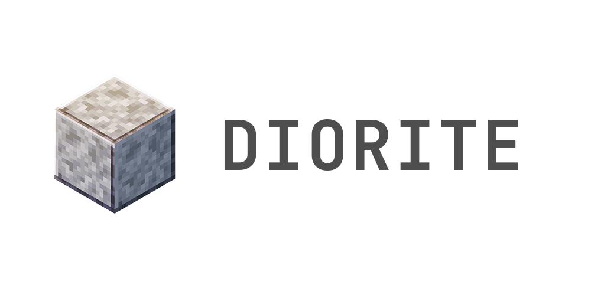

Diorite is a scripting language that lets you shape your own keybinding for almost* any website using userscript. Its almost in a good shape and production ready.

You just fork it and do your thing and just use make file to compile.

### Building From Source

Just get the Dependencies:
```
mujs
any c compiler
```
and `make`

### The initialization

The start is basically
1. Make your folder for a site and a script.js (site/script.js)
2. Write Script According to the wiki
3. Compile it
4. You get your dist/diorite.user.js

Copy it and paste it in your userscript extension. Done. You are good to go.
